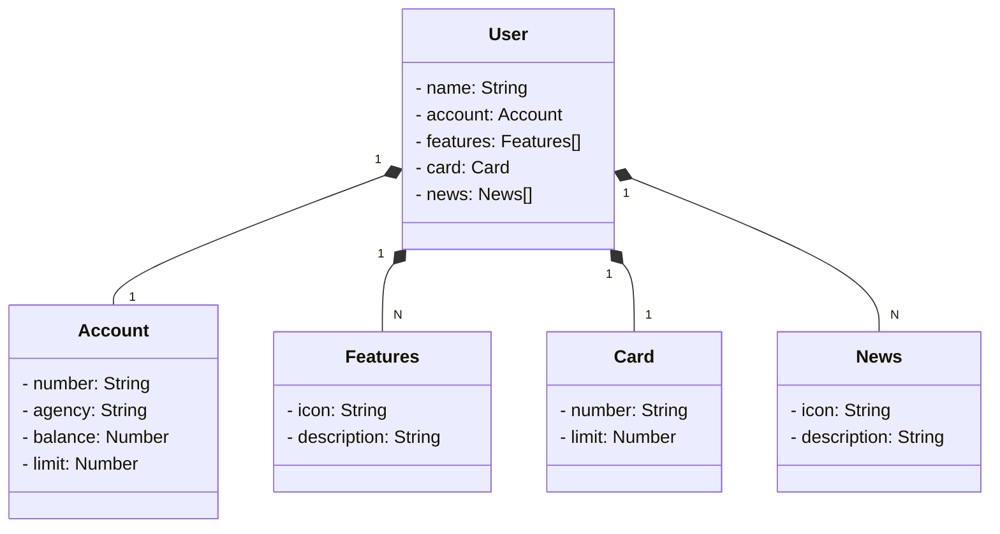

# Diagrama de classes 

```mermaid
classDiagram
  class User {
    - name: String
    - account: Account
    - features: Features[]
    - card: Card
    - news: News[]
  }
  class Account {
    - number: String
    - agency: String
    - balance: Number
    - limit: Number
  }
  class Features {
    - icon: String
    - description: String
  }
  class Card {
    - number: String
    - limit: Number
  }
  class News {
    - icon: String
    - description: String
  }

  User "1" *-- "1" Account
  User "1" *-- "N" Features
  User "1" *-- "1" Card
  User "1" *-- "N" News
```
